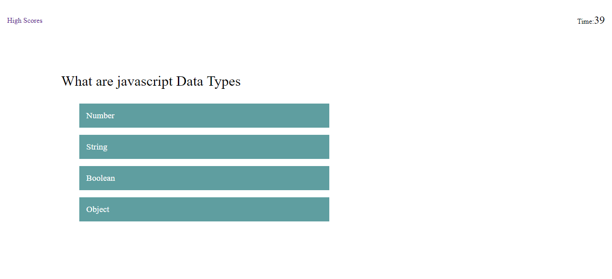

# Code Quiz

This is a quiz related to Javascript. It contains

- multiple choice questions
- informs that your answer is correct or wrong.
- gives you high score by the end.

## Link

https://github.com/Etipriya/code_quiz

## Description

This a small quiz which includes questions related to Javacript. It will improve the skills of any person as it has knowledge about:

- Javascript data types
- Who developed Javascript
- Commands in Javascript
- Keywords used in Javascript
- Operators used in Javascript

This quiz is time based, so the player must be quick in answering.

By the end of the quiz, player must enter his/her name and click the button Submit.

To view the high score, one should click on theHighScores Button on the top left side.

## Screenshots

- Home page

- First page containing first question of the quiz

- Highscores page

- Game over

## Link to the deployed application

https://etipriya.github.io/code_quiz/
